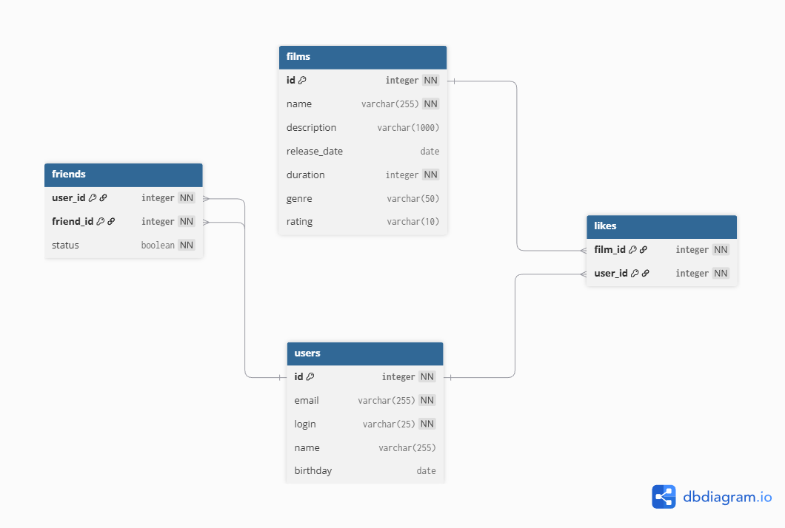

# java-filmorate

## **ER-диаграмма базы данных для приложения FilmoRate.**



Полученная схема базы данных спроектирована с соблюдением 
третьей нормальной формы и хранит в себе данные о пользователя, фильмах 
и связей между ними. 

Таблица **_users_** содержит основную информацию о пользователях приложения. 
Каждая запись имеет первичный ключ _id_.
Поля _email_ и _login_ должны иметь уникальные значения, 
чтобы предотвратить дублирование пользователей.

Таблица **_films_** хранит данные о фильмах, такие как название, описание, 
дата релиза, продолжительность, id жанра и 
id возрастного рейтинга. 

Информация о жанрах и возрастных категориях хранится в таблицах **_genres_** и **_mpa_** соответственно.

Связь дружбы между пользователями реализована через промежуточную
таблицу **_friends_**, которая описывает отношение многие-ко-многим (M:N) 
между сущностями **_users_**. Поле _user_id_ указывает на пользователя, 
инициировавшего добавление в друзья, а _friend_id_ — на второго пользователя. 
Поле _status_ отражает состояние дружбы: _false_ означает неподтверждённая
заявка в друзья, _true_ — подтверждённая. 
Составной первичный ключ 
гарантирует уникальность каждой связи и исключает повторяющиеся записи.

Лайки фильмов реализованы с помощью промежуточной таблицы **_likes_**, 
которая также представляет связь M:N между пользователями **_users_** и 
фильмами **_films_**. Каждая запись обозначает то, что конкретный 
пользователь поставил лайк конкретному фильму. Составной первичный 
ключ обеспечивает невозможность повторной отметки 
одного и того же фильма одним пользователем.

## **Примеры запросов для основных операций приложения**

`SELECT * FROM films;` - **получение всех фильмов**

`SELECT * FROM users;` - **получение всех пользователей**

`SELECT * FROM genres;` - **получение всех жанров**

`SELECT * FROM genres WHERE id = 1;` - **получение конкретного жанра по id**

`SELECT * FROM mpa WHERE id = 1;` - **получение конкретной возрастной категории по id**

**Получение топ N популярных фильмов:**

```
SELECT f.*, COUNT(l.user_id) AS likes_count

FROM films f

LEFT JOIN likes l ON f.id = l.film_id

GROUP BY f.id

ORDER BY likes_count DESC

LIMIT 10;
```

**Вывод списка общих друзей:**

```
SELECT u.*

FROM friends f1

JOIN friends f2 ON f1.friend_id = f2.friend_id

JOIN users u ON u.id = f1.friend_id

WHERE f1.user_id = 1

AND f2.user_id = 2

AND f1.status = true

AND f2.status = true;
```

**Отправление пользователем заявки в друзья:**

```
INSERT INTO friends (user_id, friend_id, status)

VALUES (1, 2, false);
```

**Подтверждение заявки в друзья:**

```
UPDATE friends

SET status = true

WHERE user_id = 1 AND friend_id = 2;
```

**Добавление лайка фильму:**

```
INSERT INTO likes (film_id, user_id)

VALUES (10, 1);
```


